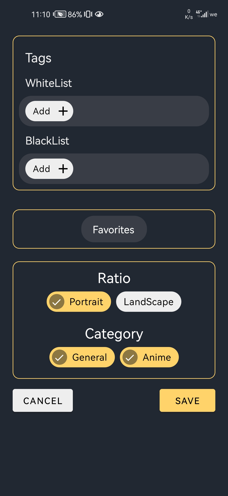
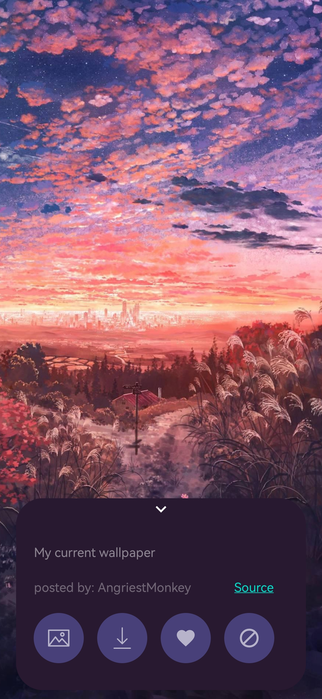
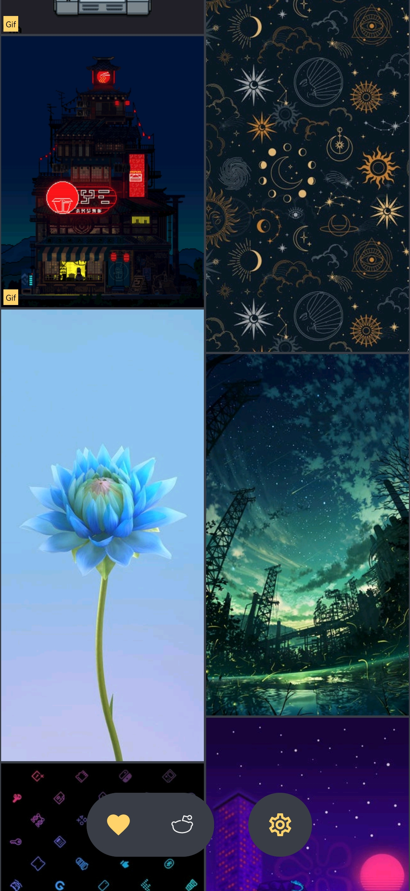
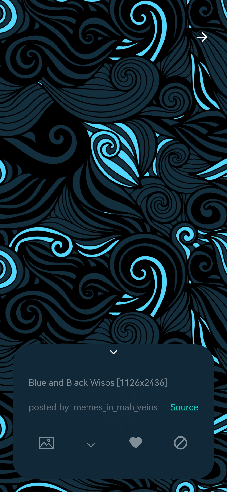
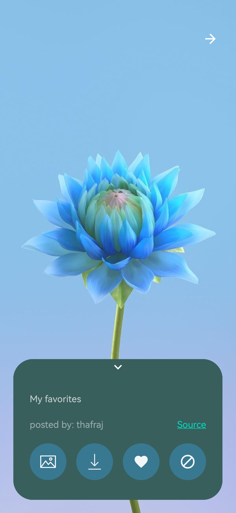

# Wallme-Wallpaper

## Download

 
 

<strong>

Wallme-wallpaper is a wallpaper app that aims to make setting wallpapers easy and without any hassle 
and at the same time have a lot of SFW wallpaper and with a good image quality with support to more than one source of wallpapers. if you have any questions check the  [Discussions](https://github.com/Alaory/WallMe-Wallpaper/discussions) tab. consider putting a star ⭐ on the project :)) it will keep me motivated.

</strong>

## images 

